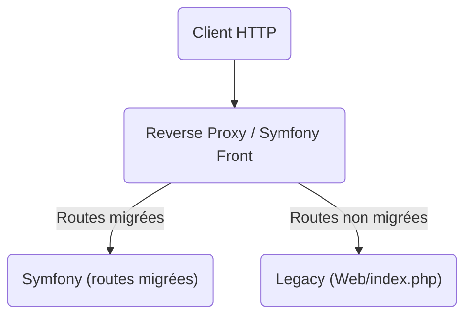

# Créer un projet symfony avec le Strangler Pattern
_Exported on 10/07/2025 at 12:17:47 UTC+2 from Cursor (1.2.2)_

---

**User**

serait il possible de créer un nouveau projet symfony dernière version en utilisant le Strangler Pattern permettant d'inclure le projet legacy en cours

---

**Cursor**

Oui, il est tout à fait possible de créer un nouveau projet Symfony (dernière version) en utilisant le Strangler Pattern pour progressivement migrer et encapsuler votre application legacy. Voici les grandes étapes à suivre pour mettre cela en place :

### 1. Création du nouveau projet Symfony

1. Créez un nouveau dossier pour le projet Symfony (par exemple, `symfony/`).
2. Installez la dernière version de Symfony dans ce dossier :
   ```bash
   composer create-project symfony/skeleton symfony
   ```

### 2. Mise en place du Strangler Pattern

Le Strangler Pattern consiste à placer le nouveau projet devant l’ancien, à intercepter les requêtes, et à les router soit vers le legacy, soit vers Symfony selon les routes migrées.

#### a. Reverse Proxy (optionnel mais recommandé)

- Configurez un reverse proxy (Apache, Nginx, ou Symfony en front) pour router les requêtes :
  - Les nouvelles routes (Symfony) sont traitées par le nouveau code.
  - Les anciennes routes sont transmises à l’application legacy.

#### b. Inclusion du legacy dans Symfony

- Vous pouvez inclure le legacy via un sous-dossier (`/Web` par exemple) ou via un VirtualHost/ProxyPass.
- Dans Symfony, créez un contrôleur “fallback” qui transfère les requêtes non gérées à l’application legacy (via un sous-répertoire ou un proxy interne).

#### c. Exemple de contrôleur “Strangler” dans Symfony

```php
// src/Controller/LegacyController.php
namespace App\Controller;

use Symfony\Component\HttpFoundation\Request;
use Symfony\Component\HttpFoundation\Response;
use Symfony\Component\HttpFoundation\StreamedResponse;
use Symfony\Component\Routing\Annotation\Route;

class LegacyController
{
    #[Route('/{path}', requirements: ['path' => '.+'], priority: -100)]
    public function legacy(Request $request, string $path): Response
    {
        // Redirige ou inclut le legacy selon votre architecture
        // Exemple simple : inclusion PHP (à adapter selon sécurité)
        $_SERVER['REQUEST_URI'] = '/' . $path;
        ob_start();
        include __DIR__ . '/../../Web/index.php';
        $content = ob_get_clean();

        return new Response($content);
    }
}
```
- Ce contrôleur attrape toutes les routes non gérées par Symfony et les transmet à l’index du legacy.

#### d. Migration progressive

- À chaque nouvelle fonctionnalité migrée, créez une nouvelle route Symfony.
- Les routes non migrées continuent d’être servies par le legacy.

### 3. Configuration du serveur web

- Configurez Apache ou Nginx pour pointer le DocumentRoot sur le dossier `symfony/public`.
- Les requêtes non gérées par Symfony sont transmises au legacy (par le contrôleur ci-dessus ou via un proxy).

---

### Résumé visuel



---

### Prochaine étape

Voulez-vous que je crée automatiquement la structure de base Symfony dans le dossier `symfony/` et que je vous génère le contrôleur “Strangler” ?  
Ou souhaitez-vous une configuration spécifique (reverse proxy, sous-domaine, etc.) ?

```shellscript
   composer create-project symfony/skeleton symfony
```

```php
// src/Controller/LegacyController.php
namespace App\Controller;

use Symfony\Component\HttpFoundation\Request;
use Symfony\Component\HttpFoundation\Response;
use Symfony\Component\HttpFoundation\StreamedResponse;
use Symfony\Component\Routing\Annotation\Route;

class LegacyController
{
    #[Route('/{path}', requirements: ['path' => '.+'], priority: -100)]
    public function legacy(Request $request, string $path): Response
    {
        // Redirige ou inclut le legacy selon votre architecture
        // Exemple simple : inclusion PHP (à adapter selon sécurité)
        $_SERVER['REQUEST_URI'] = '/' . $path;
        ob_start();
        include __DIR__ . '/../../Web/index.php';
        $content = ob_get_clean();

        return new Response($content);
    }
}
```

```plaintext
graph TD
    Client("Client HTTP")
    Proxy("Reverse Proxy / Symfony Front")
    Symfony("Symfony (routes migrées)")
    Legacy("Legacy (Web/index.php)")

    Client --> Proxy
    Proxy -- "Routes migrées" --> Symfony
    Proxy -- "Routes non migrées" --> Legacy
```

